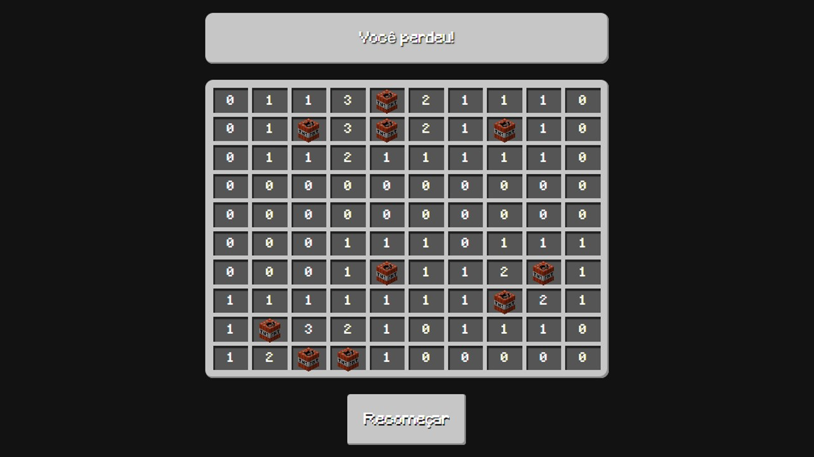

# Minecraft Minesweeper



Welcome to Minecraft Minesweeper, a classic minesweeper game with a Minecraft twist! This project is built using pure HTML, CSS, and JavaScript, allowing users to simply clone the repository and open the `index.html` file to start playing.

## Demo
Check out the live demo hosted on GitHub Pages: [Minecraft Minesweeper Demo](https://adaiasmagdiel.github.io/minecraft_minesweeper/)

## Features
- Minecraft-themed minesweeper game.
- Simple and intuitive gameplay.
- Responsive design for various screen sizes.

## How to Play
1. Clone the repository to your local machine.
   ```bash
   git clone https://github.com/AdaiasMagdiel/minecraft_minesweeper.git
   ```

2. Open the `index.html` file in your web browser.

3. Start playing by clicking on the blocks. Uncover as many blocks as you can without revealing a mine.

4. Use the numbers revealed to determine the location of mines.

5. Flag potential mine locations by right-clicking.

6. Win the game by uncovering all safe blocks, and be careful not to click on a mine!

## Technologies Used
- HTML
- CSS
- JavaScript

## Project Structure
- `index.html`: The main HTML file containing the game structure.
- `src/images`: Images used in the game.
- `src/fonts`: Similar font to Minecraft font.
- `src/sounds`: Sound effects to enhance the gaming experience.
- `src/style.css`: The CSS file for styling the game.
- `src/index.js`: The JavaScript file containing the game logic.

## Contributions
Contributions to the project are welcome! If you find any issues or have suggestions for improvements, feel free to create a pull request or open an issue.

## License
This project is licensed under the [MIT License](LICENSE).

Enjoy playing Minecraft Minesweeper! If you have any questions or feedback, feel free to reach out.
